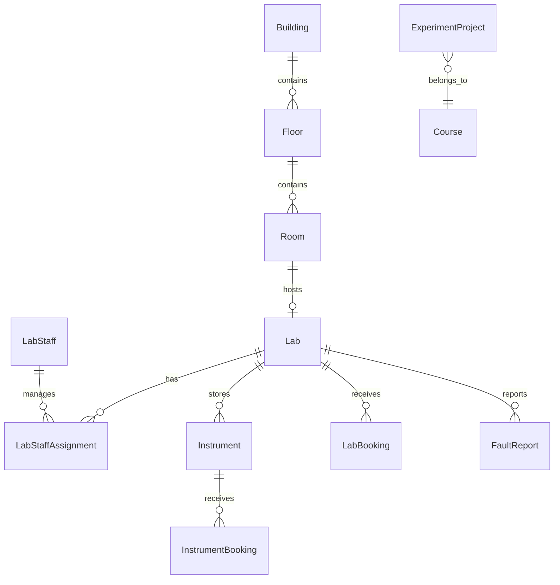

# 实验室管理系统 — 架构设计

## 1. 项目概述

面向高校的 **B/S 实验室综合管理平台**，覆盖实验室信息、设备仪器、预约审批、实验项目、故障上报、数据填报、统计分析、外部系统对接及经营性收费等全业务链条。

## 2. 技术选型

| 层级 | 技术 | 说明 |
|------|------|------|
| 后端 | Python 3.12 + FastAPI | 异步 API、OpenAPI 文档、RESTful 标准接口 |
| ORM | SQLAlchemy 2.x + Alembic | 关系型建模与版本化迁移 |
| 数据库 | PostgreSQL 16 | JSONB、事务、全文检索 |
| 缓存/队列 | Redis + Celery（P1） | 消息推送、异步任务、预约锁 |
| 前端 | React 18 + TypeScript + Vite | B/S 架构表示层 |
| UI | Ant Design 5 | 企业级组件 |
| 工作流 | 自研状态机 + 审批引擎（P1） | 多级审批、留痕追溯 |
| 认证 | SSO + JWT + RBAC | 统一身份认证对接 |
| 移动端 | 微信小程序 / 钉钉（P2） | 预约、故障上报 |
| 支付 | 银校直连 SDK（P3）★ | 分账、归集、电子回单 |

## 3. 分层架构

```
┌─────────────────────────────────────────────────────┐
│  表示层：Web 前端 / 移动端 / 可视化大屏 / 智能体      │
├─────────────────────────────────────────────────────┤
│  接口层：RESTful API / MCP API / Webhook 回调        │
├─────────────────────────────────────────────────────┤
│  业务逻辑层：各业务模块 Service + 工作流引擎          │
├─────────────────────────────────────────────────────┤
│  数据访问层：Repository + ORM                        │
├─────────────────────────────────────────────────────┤
│  数据层：PostgreSQL / Redis / 文件存储               │
├─────────────────────────────────────────────────────┤
│  集成层：SSO / 数据中心 / 门禁 / 一卡通 / 人脸中台  │
└─────────────────────────────────────────────────────┘
```

## 4. 业务模块地图

```
backend/src/modules/
├── spaces/              # 空间管理（楼栋/楼层/房间）        [P0]
├── labs/                # 实验室信息管理                    [P0]
├── lab_staff/           # 实验员管理                        [P0]
├── lab_changes/         # 实验室变更审批                    [P0]
├── users/               # 用户与 RBAC                       [P0]
├── instruments/         # 仪器台账                          [P1]
├── instrument_booking/  # 仪器预约                          [P1]
├── lab_booking/         # 实验室预约                        [P1]
├── experiment_projects/ # 实验项目管理（课程体系）            [P2]
├── experiments/         # 科研实验管理（已有 P0）           [P2]
├── faults/              # 故障上报                          [P2]
├── data_reporting/      # 教育部数据填报                    [P3]
├── statistics/          # 统计分析                          [P2]
├── integrations/        # 外部系统对接                      [P1]
├── payments/            # 收费支付 ★                        [P3]
└── workflow/            # 审批工作流引擎                    [P1]
```

## 5. 目录结构

```
lab-management/
├── docs/
│   ├── architecture.md          # 本文件
│   ├── requirements.md          # 需求规格说明书
│   ├── roadmap.md               # 开发路线图
│   └── modules/                 # 各模块详细设计
├── backend/
│   ├── pyproject.toml
│   ├── alembic/
│   └── src/
│       ├── main.py
│       ├── core/                # 配置、数据库、认证、异常
│       ├── shared/              # 通用工具（导入导出、分页）
│       └── modules/             # 业务模块
├── frontend/
│   └── src/
│       ├── app/                 # 路由与布局
│       ├── features/            # 按业务领域组织
│       └── shared/              # 通用组件
└── docker-compose.yml
```

## 6. 模块分层约定

```
modules/<domain>/
├── models.py      # SQLAlchemy 实体
├── schemas.py     # Pydantic 请求/响应
├── repository.py  # 数据访问
├── service.py     # 业务逻辑
└── router.py      # HTTP 路由
```

**全局约定：**

- API 前缀 `/api/v1`，资源复数 kebab-case
- 表名 snake_case 复数，软删除 `deleted_at`
- 审计字段 `created_at`, `updated_at`, `created_by`, `updated_by`
- 外部对接通过 `integrations/` 统一适配

## 7. 核心实体关系



## 8. 集成架构

| 外部系统 | 对接方式 | 阶段 |
|----------|----------|------|
| 统一身份认证（SSO） | OAuth2 / CAS | P0 |
| 学校数据中心 | REST API 定时同步 | P1 |
| 资产管理系统 | REST API | P1 |
| 门禁管理系统 | API + Webhook | P1 |
| 一卡通系统 | API | P1 |
| 人脸数据中台 | 增量同步 API | P1 |
| 微信/钉钉 | 消息推送 API | P1 |
| 电子班牌 | 数据推送 API | P2 |
| 银校直连/中国银行 ★ | 支付 SDK | P3 |
| 智能体（MCP） | REST + MCP 协议 | P3 |

## 9. 非功能性设计

| 维度 | 方案 |
|------|------|
| 权限 | RBAC，角色：系统管理员、院系管理员、实验室管理员、教师、学生、临时人员 |
| 审计 | 全操作留痕，变更审批可追溯 |
| 导入导出 | openpyxl，统一 ImportExportService |
| 消息 | 站内信 + 微信/钉钉 Webhook |
| 文件 | 本地/MinIO 对象存储 |
| 部署 | Docker Compose 开发，K8s 生产 |

## 10. 开发阶段

详见 [roadmap.md](./roadmap.md)。

| 阶段 | 重点 |
|------|------|
| **P0** | 空间管理、实验室信息、用户 RBAC、SSO |
| **P1** | 仪器台账、预约审批、门禁对接、数据中心同步 |
| **P2** | 实验项目、故障上报、统计、移动端 |
| **P3** | 数据填报、大屏、智能体 API、收费支付 ★ |
