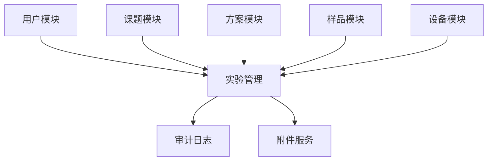

# 实验室管理系统 — 架构设计

## 1. 项目概述

本系统是一套面向科研/检测实验室的业务管理平台，核心能力包括实验全生命周期管理、样品追踪、设备调度、人员权限与审计合规。

当前阶段优先建设 **实验管理模块**，作为其他业务模块（样品、设备、试剂、课题）的参考实现。

## 2. 技术选型

| 层级 | 技术 | 说明 |
|------|------|------|
| 后端 | Python 3.12 + FastAPI | 异步 API、自动 OpenAPI 文档、类型友好 |
| ORM | SQLAlchemy 2.x + Alembic | 关系型建模与版本化迁移 |
| 数据库 | PostgreSQL 16 | JSONB 存灵活参数，事务与约束完善 |
| 前端 | React 18 + TypeScript + Vite | 组件化、类型安全、构建快 |
| UI | Ant Design 5 | 企业级表格/表单/工作流组件 |
| 状态 | TanStack Query | 服务端状态缓存与同步 |
| 认证 | JWT + RBAC | 后续迭代接入 |

## 3. 目录结构

```
lab-management/
├── docs/                          # 设计文档
│   ├── architecture.md
│   └── modules/
│       └── experiment-management.md
├── backend/
│   ├── pyproject.toml
│   ├── alembic/                   # 数据库迁移
│   └── src/
│       ├── main.py                # 应用入口
│       ├── core/                  # 配置、数据库、异常、依赖
│       └── modules/               # 业务模块（按领域划分）
│           ├── experiments/       # 实验管理 ★
│           ├── samples/           # 样品（后续）
│           ├── equipment/         # 设备（后续）
│           └── users/             # 用户（后续）
└── frontend/
    ├── package.json
    └── src/
        ├── app/                   # 路由与布局
        ├── features/              # 按业务领域组织
        │   └── experiments/
        └── shared/                # 通用组件与工具
```

## 4. 模块划分原则

每个业务模块遵循统一分层：

```
modules/<domain>/
├── models.py      # SQLAlchemy 实体
├── schemas.py     # Pydantic 请求/响应模型
├── repository.py  # 数据访问层
├── service.py     # 业务逻辑层
└── router.py      # HTTP 路由
```

**约定：**

- API 统一前缀 `/api/v1`
- 资源名复数、kebab-case：`/api/v1/experiments`
- 数据库表名 snake_case 复数：`experiments`
- 软删除：`deleted_at` 字段，查询默认过滤
- 审计字段：`created_at`, `updated_at`, `created_by`, `updated_by`

## 5. 模块依赖关系



实验模块在 MVP 阶段可独立运行（外键字段预留，关联实体后续接入）。

## 6. 非功能性要求

| 维度 | 目标 |
|------|------|
| 可追溯 | 实验状态变更、数据修改均有审计记录 |
| 权限 | 基于角色的 CRUD 与状态流转控制 |
| 扩展 | `metadata` JSONB 字段承载领域扩展属性 |
| 搜索 | 支持按编号、标题、状态、负责人、日期范围筛选 |
| 导出 | 实验报告 PDF/Excel（后续迭代） |

## 7. 开发阶段规划

| 阶段 | 内容 |
|------|------|
| **P0 — 骨架** | 项目脚手架、实验 CRUD、状态机、列表/详情 API |
| **P1 — 执行** | 实验运行记录（ExperimentRun）、步骤与结果录入 |
| **P2 — 关联** | 对接样品、设备、方案、课题 |
| **P3 — 工作流** | 审批流、通知、报告导出 |
| **P4 — 合规** | 电子签名、不可篡改日志、权限细化 |
