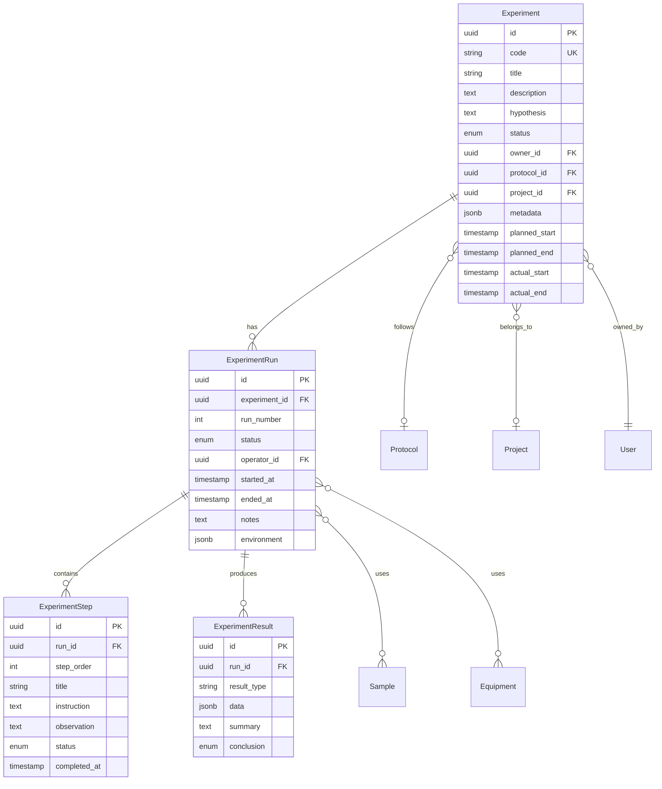
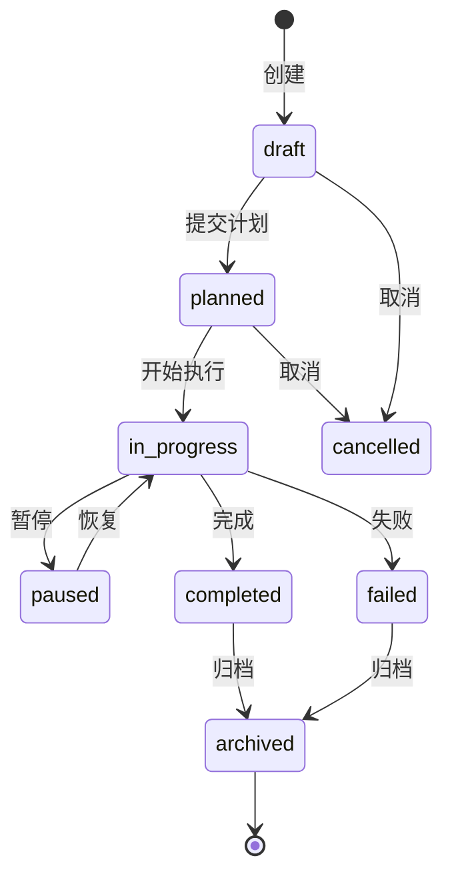

# 实验管理模块 — 领域设计

## 1. 业务背景

实验管理是实验室信息系统的核心模块，覆盖从实验立项、方案制定、执行记录到结果归档的全流程。本设计面向科研实验室与检测实验室的通用场景。

## 2. 核心概念

| 概念 | 英文 | 说明 |
|------|------|------|
| 实验 | Experiment | 一次完整的实验活动，有明确目标与方案 |
| 实验运行 | ExperimentRun | 实验的一次具体执行（可重复运行） |
| 实验方案 | Protocol | 可复用的标准操作程序（SOP） |
| 实验步骤 | ExperimentStep | 运行中的逐步操作记录 |
| 实验结果 | ExperimentResult | 结构化或半结构化的产出数据 |

## 3. 实体关系



## 4. 实验状态机



| 状态 | 含义 | 允许操作 |
|------|------|----------|
| `draft` | 草稿，信息不完整 | 编辑、删除、提交计划 |
| `planned` | 已排期，待执行 | 编辑（受限）、开始、取消 |
| `in_progress` | 执行中 | 记录数据、暂停、完成、失败 |
| `paused` | 暂停 | 恢复、取消 |
| `completed` | 正常完成 | 查看、归档 |
| `failed` | 执行失败 | 查看、重新计划、归档 |
| `cancelled` | 已取消 | 查看 |
| `archived` | 已归档，只读 | 查看、导出 |

## 5. 实验编号规则

格式：`EXP-{YYYY}-{SEQ:4}`

示例：`EXP-2026-0001`

- 按年度递增
- 创建时由系统自动生成，不可修改

## 6. API 设计

### 6.1 实验 CRUD

| 方法 | 路径 | 说明 |
|------|------|------|
| GET | `/api/v1/experiments` | 分页列表，支持筛选 |
| POST | `/api/v1/experiments` | 创建实验 |
| GET | `/api/v1/experiments/{id}` | 实验详情 |
| PATCH | `/api/v1/experiments/{id}` | 更新实验 |
| DELETE | `/api/v1/experiments/{id}` | 软删除 |

**列表筛选参数：**

- `status` — 状态（可多选）
- `owner_id` — 负责人
- `project_id` — 所属课题
- `keyword` — 标题/编号模糊搜索
- `planned_start_from` / `planned_start_to` — 计划日期范围
- `page` / `page_size` — 分页

### 6.2 状态流转

| 方法 | 路径 | 说明 |
|------|------|------|
| POST | `/api/v1/experiments/{id}/submit` | draft → planned |
| POST | `/api/v1/experiments/{id}/start` | planned → in_progress |
| POST | `/api/v1/experiments/{id}/pause` | in_progress → paused |
| POST | `/api/v1/experiments/{id}/resume` | paused → in_progress |
| POST | `/api/v1/experiments/{id}/complete` | in_progress → completed |
| POST | `/api/v1/experiments/{id}/fail` | in_progress → failed |
| POST | `/api/v1/experiments/{id}/cancel` | draft/planned → cancelled |
| POST | `/api/v1/experiments/{id}/archive` | completed/failed → archived |

### 6.3 实验运行

| 方法 | 路径 | 说明 |
|------|------|------|
| GET | `/api/v1/experiments/{id}/runs` | 运行列表 |
| POST | `/api/v1/experiments/{id}/runs` | 创建新运行 |
| GET | `/api/v1/experiment-runs/{run_id}` | 运行详情 |
| PATCH | `/api/v1/experiment-runs/{run_id}` | 更新运行 |
| POST | `/api/v1/experiment-runs/{run_id}/steps` | 添加步骤 |
| PATCH | `/api/v1/experiment-steps/{step_id}` | 更新步骤 |
| POST | `/api/v1/experiment-runs/{run_id}/results` | 录入结果 |

## 7. 前端页面规划

| 页面 | 路由 | 功能 |
|------|------|------|
| 实验列表 | `/experiments` | 表格、筛选、批量操作 |
| 创建实验 | `/experiments/new` | 表单创建 |
| 实验详情 | `/experiments/:id` | 基本信息、状态操作、运行记录 |
| 执行记录 | `/experiments/:id/runs/:runId` | 步骤录入、结果填写 |
| 实验看板 | `/experiments/board` | 按状态分栏的看板视图（P1） |

## 8. MVP 范围（P0）

**包含：**

- [x] 实验实体与状态机
- [x] 实验 CRUD API
- [x] 状态流转 API
- [x] 列表筛选与分页
- [ ] 前端列表页与详情页
- [ ] 用户认证集成

**不包含（后续迭代）：**

- 实验运行（ExperimentRun）完整流程
- 样品/设备关联
- 审批工作流
- 附件上传
- 报告导出

## 9. 数据校验规则

| 字段 | 规则 |
|------|------|
| title | 必填，1-200 字符 |
| description | 可选，最长 5000 字符 |
| hypothesis | 可选，最长 2000 字符 |
| planned_start | 提交计划时必填 |
| planned_end | 可选，须 ≥ planned_start |
| status 流转 | 必须符合状态机定义，非法流转返回 409 |

## 10. 扩展点

`metadata` JSONB 字段预留给各领域定制：

```json
{
  "temperature": 37.5,
  "incubation_hours": 24,
  "custom_tags": ["细胞培养", "对照组"],
  "instrument_settings": { "rpm": 3000, "duration_min": 10 }
}
```

后续可通过 JSON Schema 校验不同实验类型的 metadata 结构。
