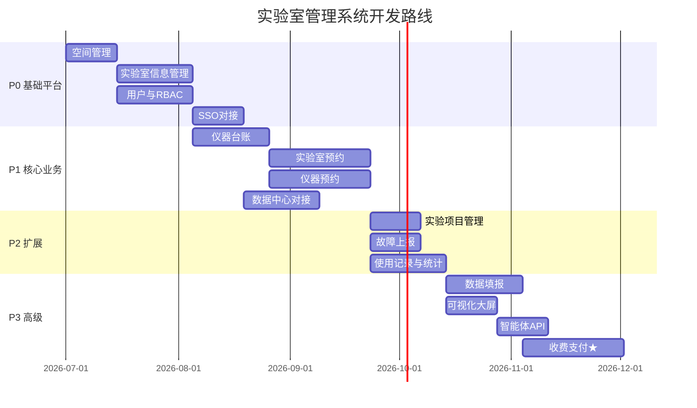
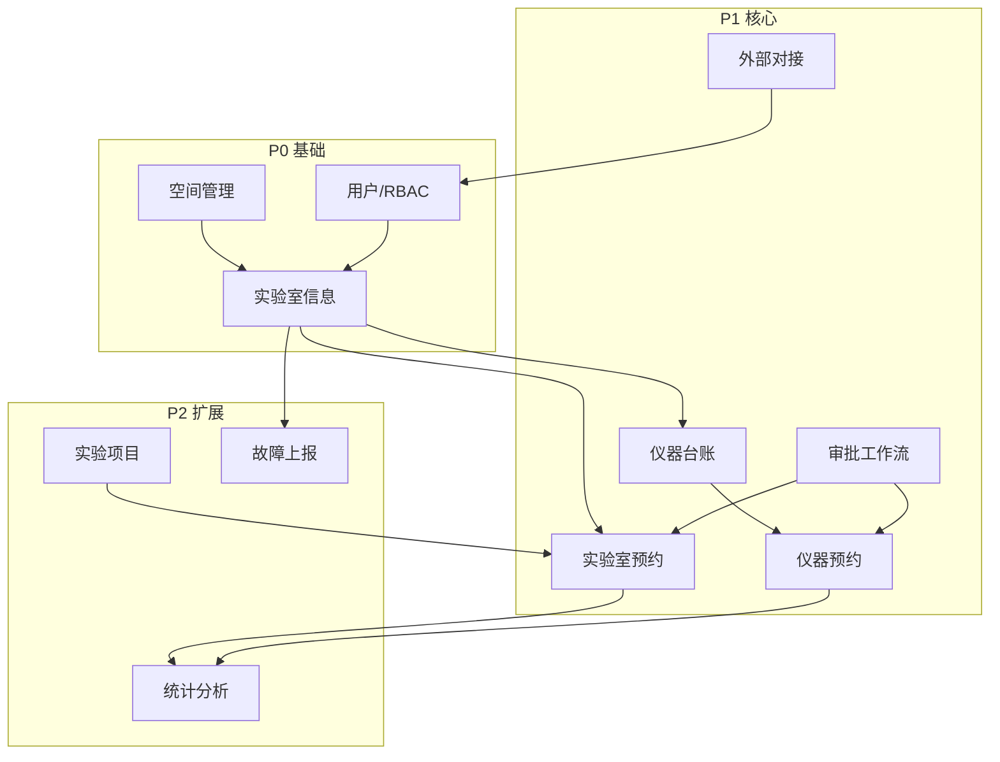

# 开发路线图

## 阶段总览

---

## P0 — 基础平台（当前阶段）

**目标：** 搭建可运行的基础平台，完成实验室信息核心管理能力。

| 序号 | 任务 | 模块 | 状态 |
|------|------|------|------|
| 0.1 | 项目脚手架 | 全局 | ✅ 已完成 |
| 0.2 | 空间管理（楼栋/楼层/房间） | M09 | ✅ 已完成 |
| 0.3 | 实验室基本信息 CRUD | M01.1 | ✅ 已完成 |
| 0.4 | 实验室多维筛选 | M01.1 | ✅ 已完成 |
| 0.5 | 实验室 Excel 导入导出 | M01.1 | ✅ 已完成 |
| 0.6 | 实验员管理与实验室绑定 | M01.3 | ✅ 已完成 |
| 0.7 | 实验室变更申请与审批 | M01.2 | ✅ 已完成 |
| 0.8 | 用户管理与 RBAC | M09 | ✅ 已完成 |
| 0.9 | SSO 单点登录对接 | M09 | 📋 待开发 |

**P0 交付物：**
- 空间层级完整 CRUD
- 实验室信息管理（含筛选、导入导出）
- 基础用户角色体系
- API 文档（OpenAPI）

---

## P1 — 核心业务

**目标：** 设备台账、实验室/仪器预约、审批流程、外部系统初步对接。

| 序号 | 任务 | 模块 |
|------|------|------|
| 1.1 | 仪器台账管理 | M02.2 |
| 1.2 | 资产系统数据同步 | M02.1 / M07 |
| 1.3 | 仪器/实验室预约规则配置 | M02.3 / M03.1 |
| 1.4 | 在线预约与日历展示 | M02.4 / M03.2 |
| 1.5 | 审批工作流引擎 | M02.5 / M03.3 |
| 1.6 | 消息推送（系统/微信/钉钉） | 全局 |
| 1.7 | 门禁系统对接 | M03.3 / M03.8 |
| 1.8 | 签到核验（一卡通/人脸） | M03.5 / M07 |
| 1.9 | 人脸数据中台对接 | M07 / M09 |

---

## P2 — 扩展能力

| 序号 | 任务 | 模块 |
|------|------|------|
| 2.1 | 实验项目管理（课程体系） | M04 |
| 2.2 | 故障上报与二维码入口 | M05 |
| 2.3 | 使用记录填报与审核 | M02.6 / M03.6 |
| 2.4 | 设备/实验室使用统计 | M02.7 / M03.7 / M08 |
| 2.5 | 实验室变更审批完善 | M01.2 |
| 2.6 | 移动端（微信/钉钉小程序） | M09 |

---

## P3 — 高级能力

| 序号 | 任务 | 模块 |
|------|------|------|
| 3.1 | 教育部基表数据填报 | M06 |
| 3.2 | 数据可视化大屏 | M09 |
| 3.3 | MCP/智能体 API 开放 | M10 |
| 3.4 | Text-to-SQL 分析接口 | M10 |
| 3.5 | 知识库文档同步 | M10 |
| 3.6 | 银校直连收费分账 ★ | M11 |
| 3.7 | 校园卡预约支付 ★ | M12 |

---

## 模块依赖关系

---

## 当前迭代重点

基于需求优先级，**本迭代（P0）** 聚焦：

1. **空间管理** — 楼栋/楼层/房间三级结构，为实验室定位提供基础
2. **实验室基本信息** — 完整字段、多维筛选、导入导出
3. **实验员管理** — 人员信息与实验室多对多绑定

变更审批、设备预约等依赖上述基础完成后进入 P1。
